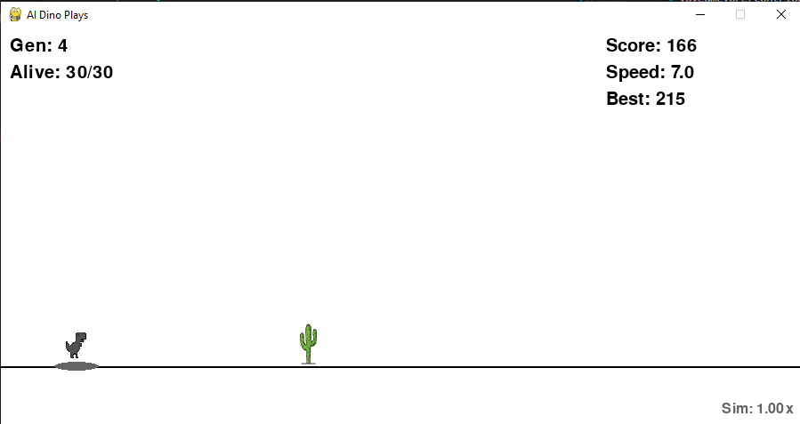

# AI Dino

This is a fun where a computer AI learns to play the "jumping dinosaur" game.

  

## What it Does

*   The computer controls many dinosaurs at the same time.
*   Each dinosaur has a small "brain" (a Neural Network).
*   The brain looks at the obstacles (cactus, birds) coming near.
*   The brain decides if the dinosaur should jump, duck, or do nothing.
*   Dinosaurs that survive longer are better.
*   The best dinosaurs make "babies" for the next round (Genetic Algorithm).
*   Over many rounds, the dinosaurs learn to play the game better by themselves!

## How to Run

1.  **Get the Code:**
    *   Download the files (or use `git clone`).

2.  **Install Necessary Stuff:**
    *   You need Python 3.
    *   Open your computer's terminal or command prompt.
    *   Type this command and press Enter:
        ```bash
        pip install pygame numpy matplotlib dill
        ```

3.  **Check `assets` Folder:**
    *   Make sure you have the `assets` folder.
    *   Inside `assets`, you need the image files (`dino.png`, `dino_duck.png`, `cactus.png`, `pterodactyl.png`).
    *   You also need the sound files (`jump.wav`, `die.wav`).

4.  **Run the Game:**
    *   Go to the project folder in your terminal.
    *   Type this command and press Enter:
        ```bash
        python main.py
        ```

## Controls (While Running)

*   `P`: Pause / Resume the game
*   `+` (Plus key): Make the game run faster
*   `-` (Minus key): Make the game run slower

## Features

*   AI learns automatically using Neural Networks and Genetic Algorithms.
*   Dino can jump and duck.
*   Different obstacles (cactus of different sizes, flying birds).
*   Game gets faster over time.
*   Saves the "brain" of the best dinosaur so it can start smart next time.
*   Shows a graph of how the score improved.

Have fun watching the AI learn!
